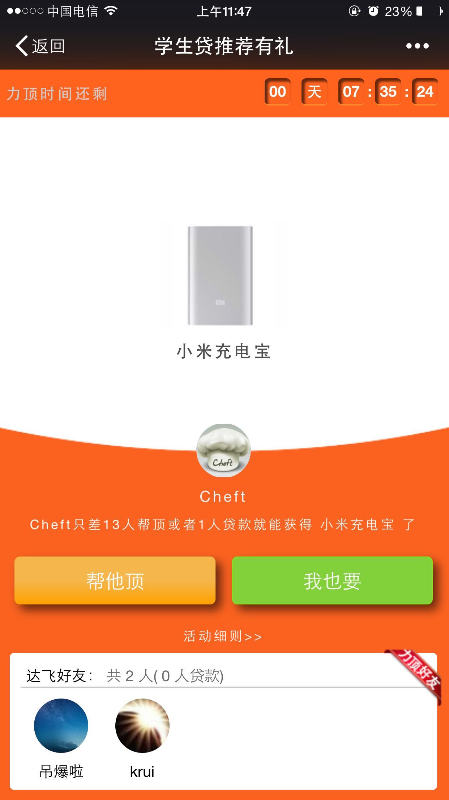
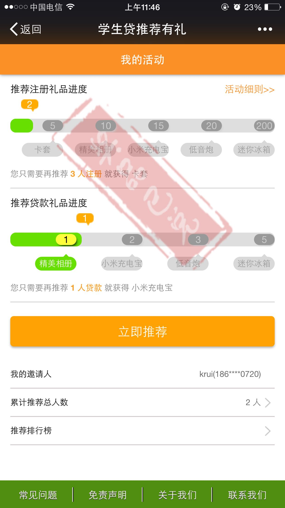
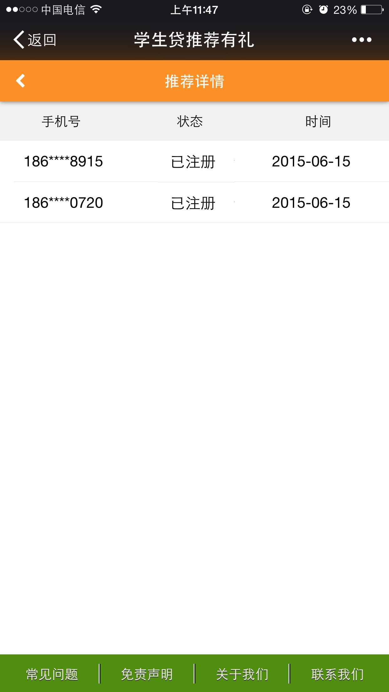
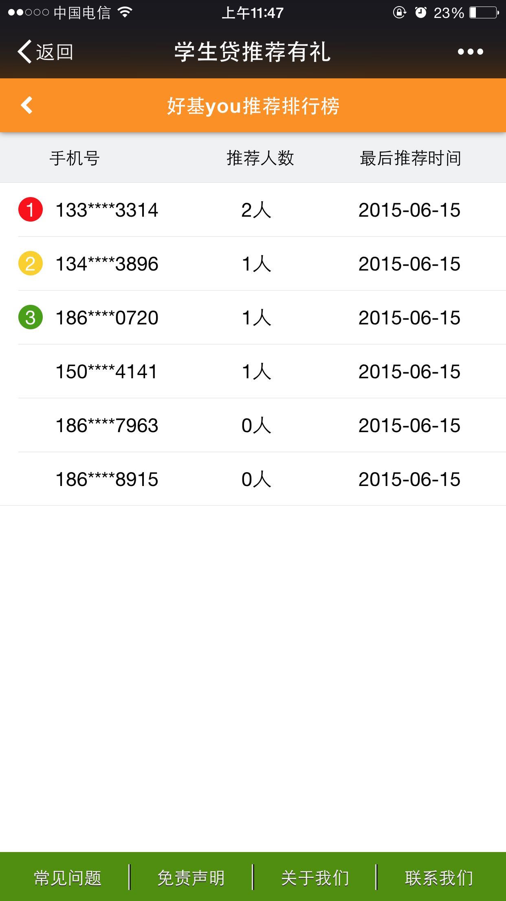

# cheftjs
是基于 riot.js 薄封装的一套类 flux 框架

    ||=====================||      
    ||     Application     ||
    ||=====================||
    ||        Router       ||
    ||=====================||
    Tag --> Actions --> Events
      \        |        /
       \     Store     /
        \_____________/
              <--

## Application
    var c = require('cheftjs');
    var app = new c.Applicaton({
        router: require('./router.js')
    })    

## Router
    module.exports = {
        routes: {
            '': 'home'
        },
        home: function() {

        }
    }

## Tag = [riot](https://github.com/riot/riot)
    <test>
        
        <h1>{result}</h1>
        <button onclick={clickMe}>test</button>
    </test>

## Actions
    
    module.exports = {
        actions: {
            clickMe: function() {
                this.result = 'click success!';
                this.trigger('clicked');
            }
        }
    }

## Store

    module.exports = {
        store: ''
    }

or

    module.exports = {
        store: {
        }
    }

### method:
* get()
* save()
* del()
* post()
* put()

## Events
    
    module.exports = {
        events: {
            init:    function() {}
            mount:   function() {}
            update:  function() {}
            updated: function() {}
            geted  : function(data, status) {}
            posted : function(data, status) {}
            puted  : function(data, status) {}
            saved  : function(data, status) {}
            deleted: function(data, status) {}
            
            clicked : function() {
                console.log('the tag can auto update');
            }
        }
    }

## Demo
    npm install
    gulp

## [Project](https://github.com/cheft/extend-frontend)

<!-- ### Snapshot

 -->